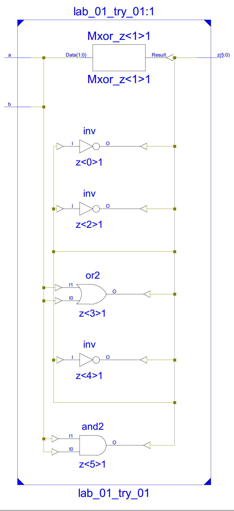

# EDA实验lab_01报告

## 实验目的

1. 输入逻辑门的设计与实现

2. 使用ISE软件设计并仿真

## 实验内容

   首先安装好*ISE 14.2*，然后启动*ISE Design Suite 14.2*，新建*project*，在*Implementation*界面新建*.v*文件并写好本次试验实验的代码：

```Verilog
module lab_01_try_01(input  wire       a,b,
                     output wire [5:0] z);
							
	assign z[5] = a & b;
	assign z[4] = ~(a & b);
	assign z[3] = a | b;
	assign z[2] = ~(a | b);
	assign z[1] = a ^ b;
	assign z[0] = ~(a ^ b);

endmodule
```

   然后在Simulation界面新建test.v文件并写好本次实验的仿真代码：

```Verilog
module lab_01_try_01_test_03;

	// Inputs
	reg a;
	reg b;

	// Outputs
	wire [5:0] z;

	// Instantiate the Unit Under Test (UUT)
	lab_01_try_01 uut (
		.a(a), 
		.b(b), 
		.z(z)
	);

	initial begin
		// Initialize Inputs
		a = 0;
		b = 0;

		// Wait 100 ns for global reset to finish
		#100;
        
		// Add stimulus here
		#200
			a <= 0;
			b <= 0;
		#200
			a <= 0;
			b <= 1;
		#200
			a <= 1;
			b <= 0;
		#200
			a <= 1;
			b <= 1;

	end
      
endmodule
```

   然后仿真并综合。

## 实验结果

综合RTL电路图：



仿真波形图：


开发板显示效果图：


## 实验感想

第一次玩，真是excited！